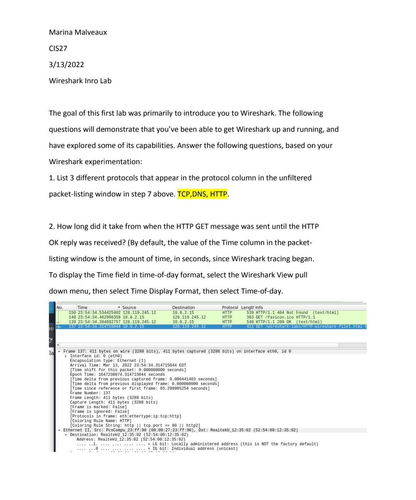

# Wireshark-intro-lab-
Intro Wireshark lab from my cybersecurity class. I Captured network traffic, identified protocols like TCP, DNS, and HTTP, analyzed HTTP GET/OK messages, and learned how to read packet details. 
## Screenshots

### Wireshark Packet Capture Overview

### HTTP GET and OK Message Details
